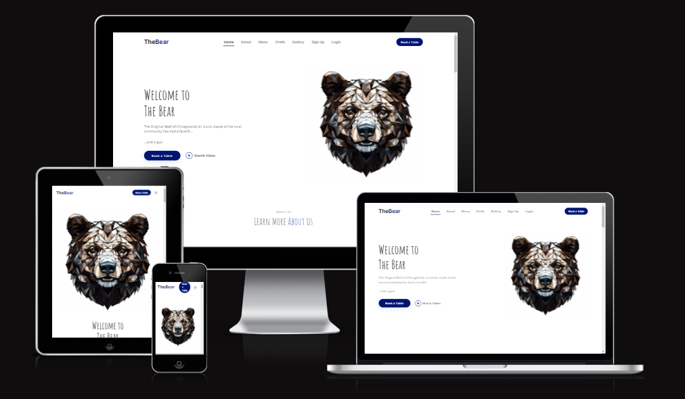
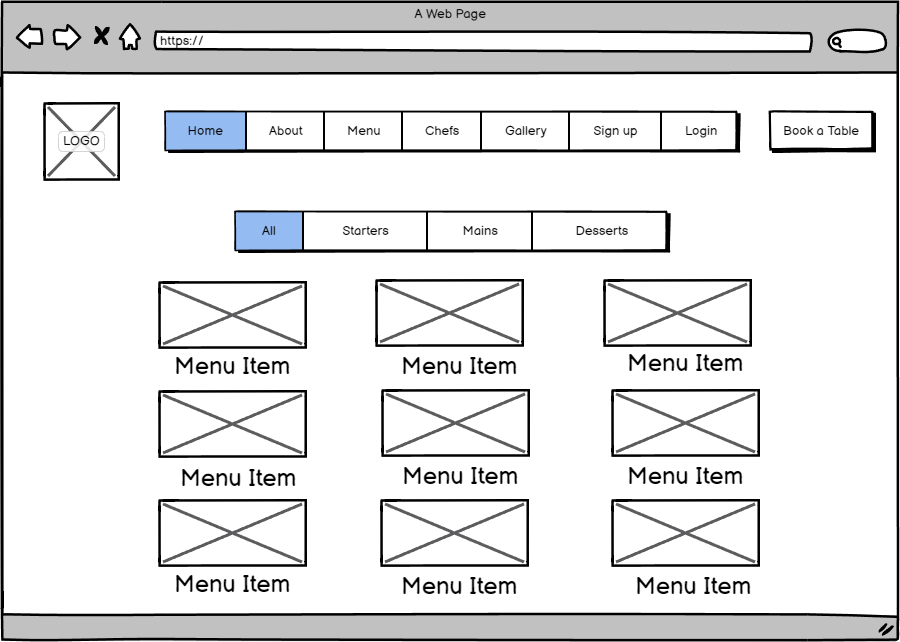
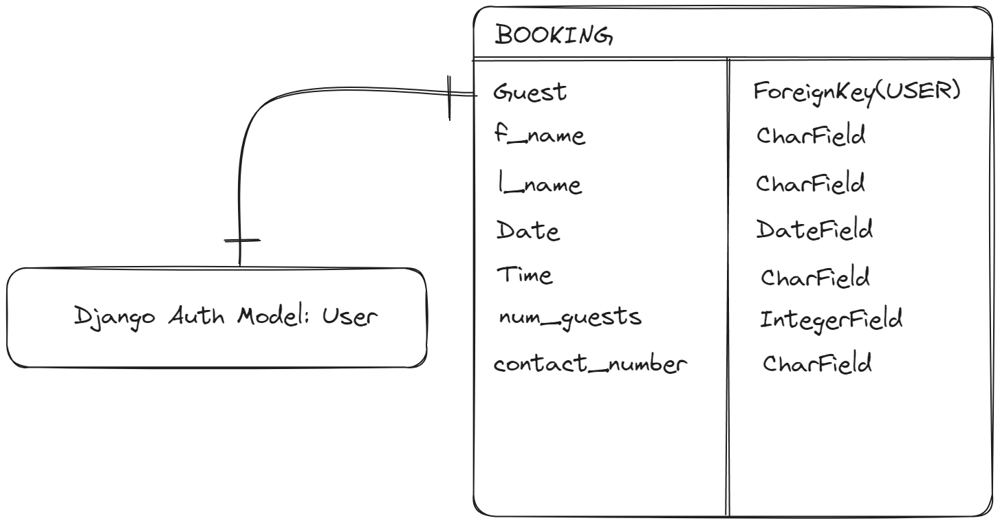

<h1 align="center">The Bear Restaurant</h1>

This project was designed as a restaurant website and booking tool for the fictional restaurant The Bear, 
based on the award winning television show of the same name. The menu, chefs, testimonials and color scheme was all created 
using ideas taken directly from or inspired by the show.
         
[View the live project here.](https://the-bear-restaurant-4c7dd7fd3896.herokuapp.com/)

## Contents

- [User Experience (UX)](#user-experience-ux)
  - [Project goals](#project-goals)
  - [User Stories](#user-stories)
  - [Agile Methodology](#agile-methodology)
  - [Design](#design)
    - [Wireframes](#wireframes)
    - [Database Schema](#database-schema)
- [Features](#features)
  - [Future Features](#future-features)
- [Technologies Used](#technologies-used)
  - [Languages](#languages)
  - [Frameworks Libraries Programs](#frameworks-libraries-programs)
- [Testing](#testing)
  - [Bugs](#bugs)
    - [Fixed Bugs](#fixed-bugs)
    - [Remaining Bugs](#remaining-bugs)
- [Deployment](#deployment)
  - [Forking the GitHub Repository](#forking-the-github-repository)
  - [Running the project locally](#running-the-project-locally)
  - [Deploying with Heroku](#deploying-with-heroku)
- [Credits](#credits)
  - [Code](#code)
  - [Media](#media)
  - [Acknowledgements](#acknowledgements)

## User Experience (UX)
-   ### Project goals  
  The overall goal of the website is to create an attractive restaurant webpage that is alluring for the visitors that creates the desire to visit the restaurant. Visitors should be able to find all relevant contact and general information about the restaurant as well as viewing the menu. Visitors should be able to make, change and cancel a reservation whilr also providing a admin managment panel for the staff members to view and control during service of the restaurant.  
  
-   ### User stories

-   ### Agile methodology
    - The principles of agile methodology were utilized during the project. By assigning user stories to issues and taking advantage of the GitHub Kanban board functionality, the necessary goals and priorities throughout the project could be well defined. In addition, labels were used to further define the priority of eacn user story in the Kanban board.  

-   ### Design
    - The Overall theme was inspired by the show and aimed to invoke the feeling of a modern restaurant renovation while still holding the feeling of nostalgia from the previous iteration of the location which is remembered fondly by the community.

     - Colors  
        - The main colour scheme stems from a deep blue that is chosen to try and match the colours of the Original Beef blue t-shirt uniforms and white to match chef whites giving the impression of a sleek, modern kitchen.  
     - Font  
        - The fonts in the theme are aimed to be simple and elegant, and reinforce that idea of a modern trendy restaurant
     - Images  
        - The images provided were mostly screenshots taken directly from the show, or from promotional material including menu items, and chef bio images. **DISCLAIMER** None of the images are owned or created by me and this project is intended for educational purposes only.
        - The main hero image of the geometric bear head is designed to be the logo of the restaurant invoking again that idea of a modern restaurant while promoting clear branding

-   ### Wireframes
    - Several wireframes were created to assist with the design however there is not an exhaustive collection of all page designs
      

-   ### Database Schema  
    - The database design schema can be viewed below. It consists of a Booking model with a foreignKey of User that relates to the standard library Django.Contrib.Auth User model.  
      

## Features  

### Navbar  

  

### Hero  

  

### Menu

  

### About

  

### Testimonials  

  

### Gallery  

  

### Contact  
 

  

### Account signup/login  

  

### Booking page  

 

### Mybookings  

 

### Delete booking  

 

### Footer  

  

### Future Features

## Technologies Used

### Languages
   - Python
   - JavaScript
   - HTML5
   - CSS3

### Frameworks, Libraries, Programs
- Python Built-in Modules:
  - [os](https://docs.python.org/3/library/os.html) 

- External Packages
  - [cloudinary](https://pypi.org/project/cloudinary/1.29.0/) 
  - [dj-database-url](https://pypi.org/project/dj-database-url/0.5.0/) 
  - [dj3-cloudinary-storage](https://pypi.org/project/dj3-cloudinary-storage/0.0.6/) 
  - [Django](https://pypi.org/project/Django/3.2.14/) 
  - [django-allauth](https://pypi.org/project/django-allauth/0.51.0/)
  - [gunicorn](https://pypi.org/project/gunicorn/20.1.0/)
  - [psycopg2](https://pypi.org/project/psycopg2/2.9.3/)
  - [crispy-forms](https://django-crispy-forms.readthedocs.io/en/latest/)

### Programs & Tools

- [Google Fonts:](https://fonts.google.com/)
  - Was used to to incorporate font styles.  
- [Bootstrap](https://getbootstrap.com/)
  - Was used to create the front-end design.
- [GitPod:](https://gitpod.io/)
  - Gitpod was used as IDE to commit and push the project to GitHub.
- [GitHub:](https://github.com/)
  - Was used for all storing and backup of the code pertaining to the project.
- [Balsamiq:](https://balsamiq.com/)
  - Was used to create wireframes
- [Excalidram:](https://excalidraw.com/)
  - Was used to create the database schema.
 

## Testing  

Both manual and automated testing was used during the final development phase of the project. Django's Unit Test

### Bugs

#### Fixed Bugs

#### Remaining Bugs
  - No known bugs remaining

## Deployment

### Forking the GitHub Repository
1. Go to [the project repository](https://github.com/JCav23/Project4-TheBear)
2. In the right most top menu, click the "Fork" button.
3. There will now be a copy of the repository in your own GitHub account.

### Running the project locally
1. Go to [the project repository](https://github.com/JCav23/Project4-TheBear)
2. Click on the "Code" button.
3. Choose one of the three options (HTTPS, SSH or GitHub CLI) and then click copy.
4. Open the terminal in you IDE program. 
5. Type `git clone` and paste the URL that was copied in step 3.
6. Press Enter and the local clone will be created. 

### Alternatively by using Gitpod:
1. Go to [the project repository](https://github.com/JCav23/Project4-TheBear)
2. Click the green button that says "Gitpod" and the project will now open up in Gitpod.

### Deploying with Heroku

I followed the below steps using the Code Institute tutorial:

The following command in the Gitpod CLI will create the relevant files needed for Heroku to install your project dependencies `pip3 freeze --local > requirements.txt`. Please note this file should be added to a .gitignore file to prevent the file from being committed.

1. Go to [Heroku.com](https://dashboard.heroku.com/apps) and log in; if you do not already have an account then you will need to create one.
2. Click the `New` dropdown and select `Create New App`.
3. Enter a name for your new project, all Heroku apps need to have a unique name, you will be prompted if you need to change it.
4. Select the region you are working in.

#### Heroku Settings  
You will need to set your Environment Variables - this is a key step to ensuring your application is deployed properly.
1. In the Settings tab, click on `Reveal Config Vars` and set the following variables:
    - Add key: `PORT` & value `8000`
    - Add key: DATABASE_URL, this should have been created automatically by Heroku.
    - Add key: CLOUDINARY_URL and the value as your cloudinary API Environment variable e.g.
    - Add key: SECRET_KEY and the value as a complex string which will be used to provide cryptographic signing.

2. Buildpacks are also required for proper deployment, simply click `Add buildpack` and search for the ones that you require.
    - For this project, I needed to add `Python`.

####  Heroku Deployment  
In the Deploy tab:
1. Connect your Heroku account to your Github Repository following these steps:
    - Click on the `Deploy` tab and choose `Github-Connect to Github`.
    - Enter the GitHub repository name and click on `Search`.
    - Choose the correct repository for your application and click on `Connect`.
2. You can then choose to deploy the project manually or automatically, automatic deployment will generate a new application every time you push a change to Github, whereas manual deployment requires you to push the `Deploy Branch` button whenever you want a change made.
3. Once you have chosen your deployment method and have clicked `Deploy Branch` your application will be built and you should now see the `View` button, click this to open your application.

## Credits

### Code
  - [Restaurantly Boostrap theme](https://bootstrapmade.com/restaurantly-restaurant-template/) was the Boostrap theme used in the project.
  - [Django Documenation](https://www.djangoproject.com/) was used to provide examples of code solutions and Django functionality.
  - [Bootstrap Documenation](https://getbootstrap.com/) was used to provide examples of Bootstrap functionality and building blocks.
  - [Code Institute walkthrough](https://codeinstitute.net/) as inspiration and code examples, the code institute walkthroughs "Hello Django" and "I Think Therefore I Blog" was used.
  - [Stack Overflow](https://stackoverflow.com/) - Dozens of different pages were used to assist during development and debuging.

### Content
  - The texts that are used for testimonials were generated by [ChatGPT](https://chat.openai.com/).
  - The content is comprised of material taken from [The Bear Fandom Wiki](https://the-bear.fandom.com/wiki/The_Bear_Wiki)

### Media
  - The hero image was found on - [DreamTimes](https://www.dreamstime.com/)
  - The video in the project comes from the FX Promo Video on [Youtube](https://youtu.be/_KLsZVMbu8U?si=fMMw56Bt94xGvoUY)

### Acknowledgements
  - The tutor support team at Code Institute for their support. In particular John who helped me with the model issue affecting the SQLite database used for the Test Suite
  - My Code Institute Mentor for feedback and suggestions.
  - Paige, who helped keep me motivated and driven during some long coding hours

  [Back to top](#contents)